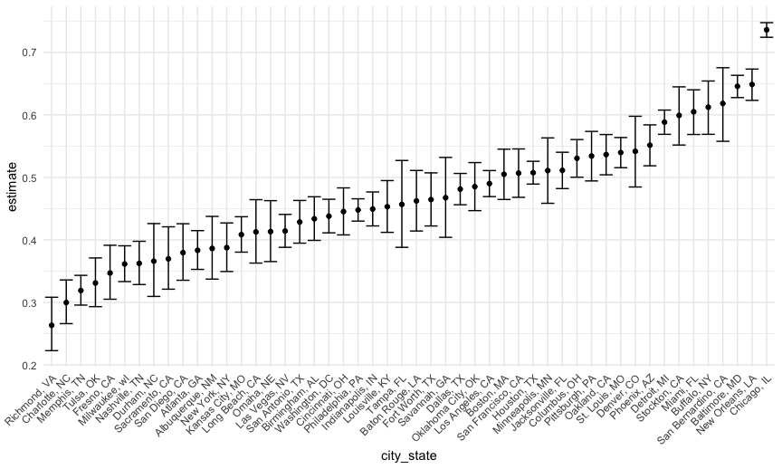

P8105 Homework 5
================
Courtney Diamond
2023-11-13

## Problem 1

First up, we are going to load the specified data. I have downloaded the
CSV from the github and saved it into a `data` file within this
repository.

``` r
homicide_data = read_csv("data/homicide-data.csv")
```

    ## Rows: 52179 Columns: 12
    ## ── Column specification ────────────────────────────────────────────────────────
    ## Delimiter: ","
    ## chr (9): uid, victim_last, victim_first, victim_race, victim_age, victim_sex...
    ## dbl (3): reported_date, lat, lon
    ## 
    ## ℹ Use `spec()` to retrieve the full column specification for this data.
    ## ℹ Specify the column types or set `show_col_types = FALSE` to quiet this message.

The raw data consists of 12 variables and 52179 individual observations.
The variables are:

- `uid`: a unique identifier for each homicide
- `reported_date`: the date the homicide was reported, in yyyymmdd
  format
- `victim_last`: the victim’s last name
- `victim_first`: the victim’s first name
- `victim_race`: the victim’s race
- `victim_age`: the victim’s age
- `victim_sex`: the victim’s sex (male, female, or unknown)
- `city`: the city of the homicide
- `state`: the state of the homicide
- `lat`: the lattitude of the homicide
- `long`: the longitude of the homicide
- `disposition`: the case status, i.e. ‘Closed by arrest’, ‘Closed
  without arrest’, or ‘Open/No arrest’

``` r
solved_unsolved_ratio_table =
  homicide_data |> 
  mutate(city_state = str_c(as.character(city), as.character(state), sep = ", ")) |> 
  filter(city_state != 'Tulsa, AL') |> 
  mutate(status = case_when(
    disposition == "Closed by arrest" ~ "solved",
    disposition == "Closed without arrest" ~ "unsolved",
    disposition == "Open/No arrest" ~ "unsolved"
  )) |>
  group_by(city_state) |> 
  summarize(all_homicides = n(),
            unsolved_homicides = sum(status == "unsolved"))

solved_unsolved_ratio_table
```

    ## # A tibble: 50 × 3
    ##    city_state      all_homicides unsolved_homicides
    ##    <chr>                   <int>              <int>
    ##  1 Albuquerque, NM           378                146
    ##  2 Atlanta, GA               973                373
    ##  3 Baltimore, MD            2827               1825
    ##  4 Baton Rouge, LA           424                196
    ##  5 Birmingham, AL            800                347
    ##  6 Boston, MA                614                310
    ##  7 Buffalo, NY               521                319
    ##  8 Charlotte, NC             687                206
    ##  9 Chicago, IL              5535               4073
    ## 10 Cincinnati, OH            694                309
    ## # ℹ 40 more rows

``` r
solved_unsolved_ratio_table |> 
  knitr::kable()
```

| city_state         | all_homicides | unsolved_homicides |
|:-------------------|--------------:|-------------------:|
| Albuquerque, NM    |           378 |                146 |
| Atlanta, GA        |           973 |                373 |
| Baltimore, MD      |          2827 |               1825 |
| Baton Rouge, LA    |           424 |                196 |
| Birmingham, AL     |           800 |                347 |
| Boston, MA         |           614 |                310 |
| Buffalo, NY        |           521 |                319 |
| Charlotte, NC      |           687 |                206 |
| Chicago, IL        |          5535 |               4073 |
| Cincinnati, OH     |           694 |                309 |
| Columbus, OH       |          1084 |                575 |
| Dallas, TX         |          1567 |                754 |
| Denver, CO         |           312 |                169 |
| Detroit, MI        |          2519 |               1482 |
| Durham, NC         |           276 |                101 |
| Fort Worth, TX     |           549 |                255 |
| Fresno, CA         |           487 |                169 |
| Houston, TX        |          2942 |               1493 |
| Indianapolis, IN   |          1322 |                594 |
| Jacksonville, FL   |          1168 |                597 |
| Kansas City, MO    |          1190 |                486 |
| Las Vegas, NV      |          1381 |                572 |
| Long Beach, CA     |           378 |                156 |
| Los Angeles, CA    |          2257 |               1106 |
| Louisville, KY     |           576 |                261 |
| Memphis, TN        |          1514 |                483 |
| Miami, FL          |           744 |                450 |
| Milwaukee, wI      |          1115 |                403 |
| Minneapolis, MN    |           366 |                187 |
| Nashville, TN      |           767 |                278 |
| New Orleans, LA    |          1434 |                930 |
| New York, NY       |           627 |                243 |
| Oakland, CA        |           947 |                508 |
| Oklahoma City, OK  |           672 |                326 |
| Omaha, NE          |           409 |                169 |
| Philadelphia, PA   |          3037 |               1360 |
| Phoenix, AZ        |           914 |                504 |
| Pittsburgh, PA     |           631 |                337 |
| Richmond, VA       |           429 |                113 |
| Sacramento, CA     |           376 |                139 |
| San Antonio, TX    |           833 |                357 |
| San Bernardino, CA |           275 |                170 |
| San Diego, CA      |           461 |                175 |
| San Francisco, CA  |           663 |                336 |
| Savannah, GA       |           246 |                115 |
| St. Louis, MO      |          1677 |                905 |
| Stockton, CA       |           444 |                266 |
| Tampa, FL          |           208 |                 95 |
| Tulsa, OK          |           583 |                193 |
| Washington, DC     |          1345 |                589 |

``` r
baltimore_homicide_prop = 
  prop.test(x = filter(solved_unsolved_ratio_table, city_state == 'Baltimore, MD') |>
              pull(unsolved_homicides),
            n = filter(solved_unsolved_ratio_table, city_state == 'Baltimore, MD') |>
              pull(all_homicides)) |> 
  broom::tidy() |> 
  select(estimate, conf.low, conf.high)

baltimore_homicide_prop
```

    ## # A tibble: 1 × 3
    ##   estimate conf.low conf.high
    ##      <dbl>    <dbl>     <dbl>
    ## 1    0.646    0.628     0.663

Ok, we worked out an example case for baltimore. Let’s make map these
functions to the whole dataframe.

``` r
calculate_unsolved_prob =
  solved_unsolved_ratio_table |> 
  mutate(prop_results = 
           map2(unsolved_homicides, all_homicides, \(x, y) prop.test(x = x, n = y)),
         tidy_results = 
           map(prop_results, broom::tidy)) |> 
  select(city_state, tidy_results) |> 
  unnest(tidy_results) |> 
  select(city_state, estimate, conf.low, conf.high) |> 
  mutate(city_state = fct_reorder(city_state, estimate))
  

calculate_unsolved_prob
```

    ## # A tibble: 50 × 4
    ##    city_state      estimate conf.low conf.high
    ##    <fct>              <dbl>    <dbl>     <dbl>
    ##  1 Albuquerque, NM    0.386    0.337     0.438
    ##  2 Atlanta, GA        0.383    0.353     0.415
    ##  3 Baltimore, MD      0.646    0.628     0.663
    ##  4 Baton Rouge, LA    0.462    0.414     0.511
    ##  5 Birmingham, AL     0.434    0.399     0.469
    ##  6 Boston, MA         0.505    0.465     0.545
    ##  7 Buffalo, NY        0.612    0.569     0.654
    ##  8 Charlotte, NC      0.300    0.266     0.336
    ##  9 Chicago, IL        0.736    0.724     0.747
    ## 10 Cincinnati, OH     0.445    0.408     0.483
    ## # ℹ 40 more rows

``` r
calculate_unsolved_prob |> 
  ggplot(aes(x = city_state, y = estimate)) +
  geom_errorbar(aes(ymin = conf.low, ymax = conf.high)) + 
  geom_point() +
  theme(axis.text.x  = element_text(angle = 45, vjust = 1, hjust = 1))
```



## Problem 2
