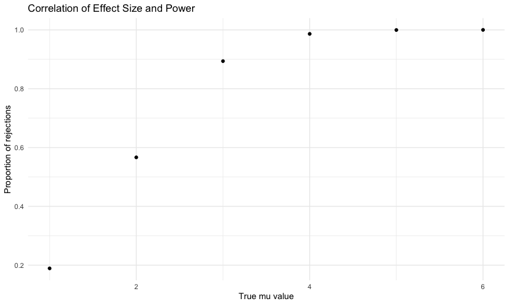
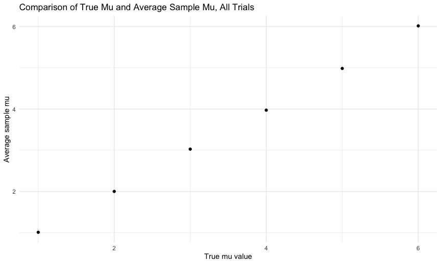
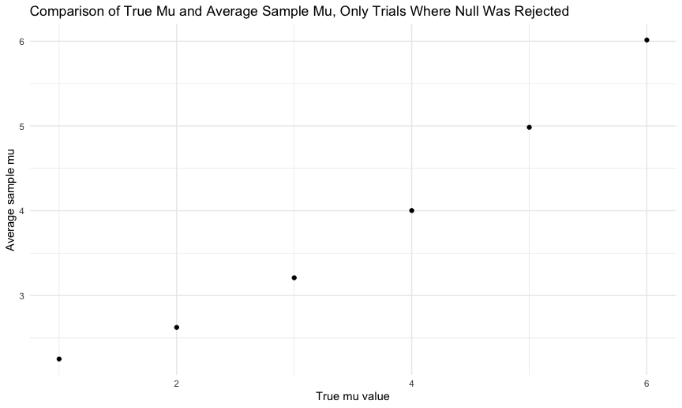

P8105 Homework 5
================
Courtney Diamond
2023-11-13

## Problem 1

First up, we are going to load the specified data. I have downloaded the
CSV from the github and saved it into a `data` file within this
repository.

``` r
homicide_data = read_csv("data/homicide-data.csv")
```

    ## Rows: 52179 Columns: 12
    ## ── Column specification ────────────────────────────────────────────────────────
    ## Delimiter: ","
    ## chr (9): uid, victim_last, victim_first, victim_race, victim_age, victim_sex...
    ## dbl (3): reported_date, lat, lon
    ## 
    ## ℹ Use `spec()` to retrieve the full column specification for this data.
    ## ℹ Specify the column types or set `show_col_types = FALSE` to quiet this message.

The raw data consists of 12 variables and 52179 individual observations.
The variables are:

- `uid`: a unique identifier for each homicide
- `reported_date`: the date the homicide was reported, in yyyymmdd
  format
- `victim_last`: the victim’s last name
- `victim_first`: the victim’s first name
- `victim_race`: the victim’s race
- `victim_age`: the victim’s age
- `victim_sex`: the victim’s sex (male, female, or unknown)
- `city`: the city of the homicide
- `state`: the state of the homicide
- `lat`: the lattitude of the homicide
- `long`: the longitude of the homicide
- `disposition`: the case status, i.e. ‘Closed by arrest’, ‘Closed
  without arrest’, or ‘Open/No arrest’

``` r
solved_unsolved_ratio_table =
  homicide_data |> 
  mutate(city_state = str_c(as.character(city), as.character(state), sep = ", ")) |> 
  filter(city_state != 'Tulsa, AL') |> 
  mutate(status = case_when(
    disposition == "Closed by arrest" ~ "solved",
    disposition == "Closed without arrest" ~ "unsolved",
    disposition == "Open/No arrest" ~ "unsolved"
  )) |>
  group_by(city_state) |> 
  summarize(all_homicides = n(),
            unsolved_homicides = sum(status == "unsolved"))

solved_unsolved_ratio_table
```

    ## # A tibble: 50 × 3
    ##    city_state      all_homicides unsolved_homicides
    ##    <chr>                   <int>              <int>
    ##  1 Albuquerque, NM           378                146
    ##  2 Atlanta, GA               973                373
    ##  3 Baltimore, MD            2827               1825
    ##  4 Baton Rouge, LA           424                196
    ##  5 Birmingham, AL            800                347
    ##  6 Boston, MA                614                310
    ##  7 Buffalo, NY               521                319
    ##  8 Charlotte, NC             687                206
    ##  9 Chicago, IL              5535               4073
    ## 10 Cincinnati, OH            694                309
    ## # ℹ 40 more rows

``` r
solved_unsolved_ratio_table |> 
  knitr::kable()
```

| city_state         | all_homicides | unsolved_homicides |
|:-------------------|--------------:|-------------------:|
| Albuquerque, NM    |           378 |                146 |
| Atlanta, GA        |           973 |                373 |
| Baltimore, MD      |          2827 |               1825 |
| Baton Rouge, LA    |           424 |                196 |
| Birmingham, AL     |           800 |                347 |
| Boston, MA         |           614 |                310 |
| Buffalo, NY        |           521 |                319 |
| Charlotte, NC      |           687 |                206 |
| Chicago, IL        |          5535 |               4073 |
| Cincinnati, OH     |           694 |                309 |
| Columbus, OH       |          1084 |                575 |
| Dallas, TX         |          1567 |                754 |
| Denver, CO         |           312 |                169 |
| Detroit, MI        |          2519 |               1482 |
| Durham, NC         |           276 |                101 |
| Fort Worth, TX     |           549 |                255 |
| Fresno, CA         |           487 |                169 |
| Houston, TX        |          2942 |               1493 |
| Indianapolis, IN   |          1322 |                594 |
| Jacksonville, FL   |          1168 |                597 |
| Kansas City, MO    |          1190 |                486 |
| Las Vegas, NV      |          1381 |                572 |
| Long Beach, CA     |           378 |                156 |
| Los Angeles, CA    |          2257 |               1106 |
| Louisville, KY     |           576 |                261 |
| Memphis, TN        |          1514 |                483 |
| Miami, FL          |           744 |                450 |
| Milwaukee, wI      |          1115 |                403 |
| Minneapolis, MN    |           366 |                187 |
| Nashville, TN      |           767 |                278 |
| New Orleans, LA    |          1434 |                930 |
| New York, NY       |           627 |                243 |
| Oakland, CA        |           947 |                508 |
| Oklahoma City, OK  |           672 |                326 |
| Omaha, NE          |           409 |                169 |
| Philadelphia, PA   |          3037 |               1360 |
| Phoenix, AZ        |           914 |                504 |
| Pittsburgh, PA     |           631 |                337 |
| Richmond, VA       |           429 |                113 |
| Sacramento, CA     |           376 |                139 |
| San Antonio, TX    |           833 |                357 |
| San Bernardino, CA |           275 |                170 |
| San Diego, CA      |           461 |                175 |
| San Francisco, CA  |           663 |                336 |
| Savannah, GA       |           246 |                115 |
| St. Louis, MO      |          1677 |                905 |
| Stockton, CA       |           444 |                266 |
| Tampa, FL          |           208 |                 95 |
| Tulsa, OK          |           583 |                193 |
| Washington, DC     |          1345 |                589 |

``` r
baltimore_homicide_prop = 
  prop.test(x = filter(solved_unsolved_ratio_table, city_state == 'Baltimore, MD') |>
              pull(unsolved_homicides),
            n = filter(solved_unsolved_ratio_table, city_state == 'Baltimore, MD') |>
              pull(all_homicides)) |> 
  broom::tidy() |> 
  select(estimate, conf.low, conf.high)

baltimore_homicide_prop
```

    ## # A tibble: 1 × 3
    ##   estimate conf.low conf.high
    ##      <dbl>    <dbl>     <dbl>
    ## 1    0.646    0.628     0.663

Ok, we worked out an example case for baltimore. Let’s make map these
functions to the whole dataframe.

``` r
calculate_unsolved_prob =
  solved_unsolved_ratio_table |> 
  mutate(prop_results = 
           map2(unsolved_homicides, all_homicides, \(x, y) prop.test(x = x, n = y)),
         tidy_results = 
           map(prop_results, broom::tidy)) |> 
  select(city_state, tidy_results) |> 
  unnest(tidy_results) |> 
  select(city_state, estimate, conf.low, conf.high) |> 
  mutate(city_state = fct_reorder(city_state, estimate))
  
calculate_unsolved_prob
```

    ## # A tibble: 50 × 4
    ##    city_state      estimate conf.low conf.high
    ##    <fct>              <dbl>    <dbl>     <dbl>
    ##  1 Albuquerque, NM    0.386    0.337     0.438
    ##  2 Atlanta, GA        0.383    0.353     0.415
    ##  3 Baltimore, MD      0.646    0.628     0.663
    ##  4 Baton Rouge, LA    0.462    0.414     0.511
    ##  5 Birmingham, AL     0.434    0.399     0.469
    ##  6 Boston, MA         0.505    0.465     0.545
    ##  7 Buffalo, NY        0.612    0.569     0.654
    ##  8 Charlotte, NC      0.300    0.266     0.336
    ##  9 Chicago, IL        0.736    0.724     0.747
    ## 10 Cincinnati, OH     0.445    0.408     0.483
    ## # ℹ 40 more rows

``` r
calculate_unsolved_prob |> 
  ggplot(aes(x = city_state, y = estimate)) +
  geom_errorbar(aes(ymin = conf.low, ymax = conf.high)) + 
  geom_point() +
  theme(axis.text.x  = element_text(angle = 45, vjust = 1, hjust = 1))
```


## Problem 2

First I need to load my data. In my case, I saved the Problem 1 dataset
to the same “data” folder that I’m using for problem 2, which explains
these first few lines of my code where I need to drop this file from the
list I’m trying to consider.

``` r
files_list = list.files("data")[-21]
files_list
```

    ##  [1] "con_01.csv" "con_02.csv" "con_03.csv" "con_04.csv" "con_05.csv"
    ##  [6] "con_06.csv" "con_07.csv" "con_08.csv" "con_09.csv" "con_10.csv"
    ## [11] "exp_01.csv" "exp_02.csv" "exp_03.csv" "exp_04.csv" "exp_05.csv"
    ## [16] "exp_06.csv" "exp_07.csv" "exp_08.csv" "exp_09.csv" "exp_10.csv"

``` r
files_df = tibble(
  files_list
)

study_results = files_df |> 
  mutate(files_name = str_c("data/", files_list)) |> 
  mutate(data = map(files_name, read_csv)) |> 
  unnest(data) |> 
  mutate(across(where(is.numeric), ~ num(.x, digits = 2))) |> 
  mutate(study_arm = str_sub(files_list, 1, 3),
         study_arm = as.factor(study_arm)) |> 
  mutate(study_id = str_sub(files_list, 1, 6)) |> 
  select(!files_name) |> 
  select(files_list, study_id, study_arm, week_1:week_8) |> 
  pivot_longer(week_1:week_8, names_to = 'study_week', values_to = 'study_values') |> 
  mutate(study_week = str_sub(study_week, -1, -1),
         study_week = as.numeric(study_week))
```

    ## Rows: 1 Columns: 8
    ## ── Column specification ────────────────────────────────────────────────────────
    ## Delimiter: ","
    ## dbl (8): week_1, week_2, week_3, week_4, week_5, week_6, week_7, week_8
    ## 
    ## ℹ Use `spec()` to retrieve the full column specification for this data.
    ## ℹ Specify the column types or set `show_col_types = FALSE` to quiet this message.
    ## Rows: 1 Columns: 8
    ## ── Column specification ────────────────────────────────────────────────────────
    ## Delimiter: ","
    ## dbl (8): week_1, week_2, week_3, week_4, week_5, week_6, week_7, week_8
    ## 
    ## ℹ Use `spec()` to retrieve the full column specification for this data.
    ## ℹ Specify the column types or set `show_col_types = FALSE` to quiet this message.
    ## Rows: 1 Columns: 8
    ## ── Column specification ────────────────────────────────────────────────────────
    ## Delimiter: ","
    ## dbl (8): week_1, week_2, week_3, week_4, week_5, week_6, week_7, week_8
    ## 
    ## ℹ Use `spec()` to retrieve the full column specification for this data.
    ## ℹ Specify the column types or set `show_col_types = FALSE` to quiet this message.
    ## Rows: 1 Columns: 8
    ## ── Column specification ────────────────────────────────────────────────────────
    ## Delimiter: ","
    ## dbl (8): week_1, week_2, week_3, week_4, week_5, week_6, week_7, week_8
    ## 
    ## ℹ Use `spec()` to retrieve the full column specification for this data.
    ## ℹ Specify the column types or set `show_col_types = FALSE` to quiet this message.
    ## Rows: 1 Columns: 8
    ## ── Column specification ────────────────────────────────────────────────────────
    ## Delimiter: ","
    ## dbl (8): week_1, week_2, week_3, week_4, week_5, week_6, week_7, week_8
    ## 
    ## ℹ Use `spec()` to retrieve the full column specification for this data.
    ## ℹ Specify the column types or set `show_col_types = FALSE` to quiet this message.
    ## Rows: 1 Columns: 8
    ## ── Column specification ────────────────────────────────────────────────────────
    ## Delimiter: ","
    ## dbl (8): week_1, week_2, week_3, week_4, week_5, week_6, week_7, week_8
    ## 
    ## ℹ Use `spec()` to retrieve the full column specification for this data.
    ## ℹ Specify the column types or set `show_col_types = FALSE` to quiet this message.
    ## Rows: 1 Columns: 8
    ## ── Column specification ────────────────────────────────────────────────────────
    ## Delimiter: ","
    ## dbl (8): week_1, week_2, week_3, week_4, week_5, week_6, week_7, week_8
    ## 
    ## ℹ Use `spec()` to retrieve the full column specification for this data.
    ## ℹ Specify the column types or set `show_col_types = FALSE` to quiet this message.
    ## Rows: 1 Columns: 8
    ## ── Column specification ────────────────────────────────────────────────────────
    ## Delimiter: ","
    ## dbl (8): week_1, week_2, week_3, week_4, week_5, week_6, week_7, week_8
    ## 
    ## ℹ Use `spec()` to retrieve the full column specification for this data.
    ## ℹ Specify the column types or set `show_col_types = FALSE` to quiet this message.
    ## Rows: 1 Columns: 8
    ## ── Column specification ────────────────────────────────────────────────────────
    ## Delimiter: ","
    ## dbl (8): week_1, week_2, week_3, week_4, week_5, week_6, week_7, week_8
    ## 
    ## ℹ Use `spec()` to retrieve the full column specification for this data.
    ## ℹ Specify the column types or set `show_col_types = FALSE` to quiet this message.
    ## Rows: 1 Columns: 8
    ## ── Column specification ────────────────────────────────────────────────────────
    ## Delimiter: ","
    ## dbl (8): week_1, week_2, week_3, week_4, week_5, week_6, week_7, week_8
    ## 
    ## ℹ Use `spec()` to retrieve the full column specification for this data.
    ## ℹ Specify the column types or set `show_col_types = FALSE` to quiet this message.
    ## Rows: 1 Columns: 8
    ## ── Column specification ────────────────────────────────────────────────────────
    ## Delimiter: ","
    ## dbl (8): week_1, week_2, week_3, week_4, week_5, week_6, week_7, week_8
    ## 
    ## ℹ Use `spec()` to retrieve the full column specification for this data.
    ## ℹ Specify the column types or set `show_col_types = FALSE` to quiet this message.
    ## Rows: 1 Columns: 8
    ## ── Column specification ────────────────────────────────────────────────────────
    ## Delimiter: ","
    ## dbl (8): week_1, week_2, week_3, week_4, week_5, week_6, week_7, week_8
    ## 
    ## ℹ Use `spec()` to retrieve the full column specification for this data.
    ## ℹ Specify the column types or set `show_col_types = FALSE` to quiet this message.
    ## Rows: 1 Columns: 8
    ## ── Column specification ────────────────────────────────────────────────────────
    ## Delimiter: ","
    ## dbl (8): week_1, week_2, week_3, week_4, week_5, week_6, week_7, week_8
    ## 
    ## ℹ Use `spec()` to retrieve the full column specification for this data.
    ## ℹ Specify the column types or set `show_col_types = FALSE` to quiet this message.
    ## Rows: 1 Columns: 8
    ## ── Column specification ────────────────────────────────────────────────────────
    ## Delimiter: ","
    ## dbl (8): week_1, week_2, week_3, week_4, week_5, week_6, week_7, week_8
    ## 
    ## ℹ Use `spec()` to retrieve the full column specification for this data.
    ## ℹ Specify the column types or set `show_col_types = FALSE` to quiet this message.
    ## Rows: 1 Columns: 8
    ## ── Column specification ────────────────────────────────────────────────────────
    ## Delimiter: ","
    ## dbl (8): week_1, week_2, week_3, week_4, week_5, week_6, week_7, week_8
    ## 
    ## ℹ Use `spec()` to retrieve the full column specification for this data.
    ## ℹ Specify the column types or set `show_col_types = FALSE` to quiet this message.
    ## Rows: 1 Columns: 8
    ## ── Column specification ────────────────────────────────────────────────────────
    ## Delimiter: ","
    ## dbl (8): week_1, week_2, week_3, week_4, week_5, week_6, week_7, week_8
    ## 
    ## ℹ Use `spec()` to retrieve the full column specification for this data.
    ## ℹ Specify the column types or set `show_col_types = FALSE` to quiet this message.
    ## Rows: 1 Columns: 8
    ## ── Column specification ────────────────────────────────────────────────────────
    ## Delimiter: ","
    ## dbl (8): week_1, week_2, week_3, week_4, week_5, week_6, week_7, week_8
    ## 
    ## ℹ Use `spec()` to retrieve the full column specification for this data.
    ## ℹ Specify the column types or set `show_col_types = FALSE` to quiet this message.
    ## Rows: 1 Columns: 8
    ## ── Column specification ────────────────────────────────────────────────────────
    ## Delimiter: ","
    ## dbl (8): week_1, week_2, week_3, week_4, week_5, week_6, week_7, week_8
    ## 
    ## ℹ Use `spec()` to retrieve the full column specification for this data.
    ## ℹ Specify the column types or set `show_col_types = FALSE` to quiet this message.
    ## Rows: 1 Columns: 8
    ## ── Column specification ────────────────────────────────────────────────────────
    ## Delimiter: ","
    ## dbl (8): week_1, week_2, week_3, week_4, week_5, week_6, week_7, week_8
    ## 
    ## ℹ Use `spec()` to retrieve the full column specification for this data.
    ## ℹ Specify the column types or set `show_col_types = FALSE` to quiet this message.
    ## Rows: 1 Columns: 8
    ## ── Column specification ────────────────────────────────────────────────────────
    ## Delimiter: ","
    ## dbl (8): week_1, week_2, week_3, week_4, week_5, week_6, week_7, week_8
    ## 
    ## ℹ Use `spec()` to retrieve the full column specification for this data.
    ## ℹ Specify the column types or set `show_col_types = FALSE` to quiet this message.

``` r
study_results |> 
  ggplot(aes(x = study_week, y = study_values, color = study_id)) + 
  geom_line(aes(linetype = study_arm)) +
  labs(title = "Weekly Study Measurement Values",
       x = "Study Week",
       y = "Study Measurement Values",
       color = "Subject ID",
       linetype = "Study Arm")
```


The above spaghetti plot shows the changes in weekly study values across
both study arms (control and experimental). We can see that the control
arm, represented by the solid lines, have some week-to-week variation
but ultimately there isn’t a net increase or decrease in values from the
first measurement to the last. In the experimental arm, we see overall
net increases in the study value over the span of the trial.

## Problem 3

``` r
n = 30
sigma = 5
```

For the first part of the problem, I’m going to do a single example
using a single value of `mu`, which will serve as a proof of concept and
template for how I want to ultimately structure my data for the full
run.

``` r
mu = 0

output_datasets = vector("list", length = 5000)

for (i in 1:5000) {
  output_datasets[[i]] = rnorm(n = n, mean = mu, sd = sigma)
}

normal_distribution_df = tibble(
  output_datasets
)

normal_distribution_df |> 
  mutate(t_stats = map(output_datasets, \(x) t.test(x = x, mu = 0, conf.level = 0.95))) |> 
  mutate(tidy_t_stats = map(t_stats, broom::tidy)) |> 
  unnest(tidy_t_stats) |> 
  select(output_datasets, estimate, p.value) |> 
  mutate(reject_the_null = case_when(
    p.value <= 0.05 ~ "reject",
    p.value > 0.05 ~ "fail to reject"
  ))
```

    ## # A tibble: 5,000 × 4
    ##    output_datasets estimate p.value reject_the_null
    ##    <list>             <dbl>   <dbl> <chr>          
    ##  1 <dbl [30]>        0.0581  0.962  fail to reject 
    ##  2 <dbl [30]>        0.820   0.336  fail to reject 
    ##  3 <dbl [30]>       -0.0156  0.987  fail to reject 
    ##  4 <dbl [30]>       -0.0459  0.945  fail to reject 
    ##  5 <dbl [30]>       -1.20    0.225  fail to reject 
    ##  6 <dbl [30]>        0.764   0.305  fail to reject 
    ##  7 <dbl [30]>       -0.909   0.354  fail to reject 
    ##  8 <dbl [30]>       -1.81    0.0691 fail to reject 
    ##  9 <dbl [30]>        0.904   0.328  fail to reject 
    ## 10 <dbl [30]>        0.0752  0.927  fail to reject 
    ## # ℹ 4,990 more rows

Ok, now I can start to consider how I want to store my data to run these
trials across all different values of `mu`.

``` r
normal_dist_ttest_sim_df = 
  expand_grid(
    mu = c(1:6),
    iter = 1:5000
  ) |> 
  mutate(output_dataset = map(mu, \(x) rnorm(n = n, mean = x, sd = sigma))) |> 
  mutate(t_stats = map(output_dataset, \(x) t.test(x = x, mu = 0, conf.level = 0.95))) |> 
  mutate(tidy_t_stats = map(t_stats, broom::tidy)) |> 
  unnest(tidy_t_stats) |> 
  select(mu, iter, output_dataset, estimate, p.value) |> 
  mutate(reject_the_null = case_when(
    p.value <= 0.05 ~ "reject",
    p.value > 0.05 ~ "fail to reject"
  )) |> 
  mutate(reject_the_null = as.factor(reject_the_null))

normal_dist_ttest_sim_df |> 
  group_by(mu) |> 
  summarize(num_trials = n(),
            num_reject = sum(reject_the_null == 'reject')) |> 
  mutate(rejection_proportion = num_reject/num_trials) |> 
  ggplot(aes(x = mu, y = rejection_proportion)) + 
  geom_point() + 
  labs(title = "Correlation of Effect Size and Power", 
       x = "True mu value",
       y = "Proportion of rejections") 
```



The above graph demonstrates the principle that as the effect size we
are looking to detect increases, the power of our test also increases.
When the true `mu` was 1 and the null hypothesis `mu` was 0, we had very
few instances in which we rejected the null hypothesis, compared to when
our true `mu` was 6 and the null hypothesis `mu` was 0 in which every
test resulted in rejecting the null.

``` r
normal_dist_ttest_sim_df |> 
  group_by(mu) |> 
  summarize(average_mu_hat = mean(estimate)) |> 
  ggplot(aes(x = mu, y = average_mu_hat)) +
  geom_point() + 
  labs(title = "Comparison of True Mu and Average Sample Mu, All Trials",
       x = "True mu value",
       y = "Average sample mu")
```



``` r
normal_dist_ttest_sim_df |> 
  group_by(mu) |> 
  filter(reject_the_null == "reject") |> 
  summarize(average_mu_hat = mean(estimate)) |> 
  ggplot(aes(x = mu, y = average_mu_hat)) + 
  geom_point() + 
  labs(title = "Comparison of True Mu and Average Sample Mu, Only Trials Where Null Was Rejected",
       x = "True mu value",
       y = "Average sample mu")
```



The above graphs demonstrate the notion that, fundamentally, the samples
which result in us being able to reject the null hypothesis
fundamentally have a different average mu hat than those samples for
which we do not ultimately reject the null hypothesis. This makes sense-
our hypothesis test is essentially asking whether we can believe that
our data come from some prespecified null distribution (in our case,
this was always a Normal distribution with mu = 0), and we reject the
null when we have enough evidence that these data are likely coming from
a different distribution. To oversimplify, we wanted to see if our data
were “extreme” enough to reject the null. When we look at the averages
of only those samples where we’ve essentially said “Yes, these are some
extreme data”, they are going to be skewed compared to the averages of
ALL the samples that we generated.
